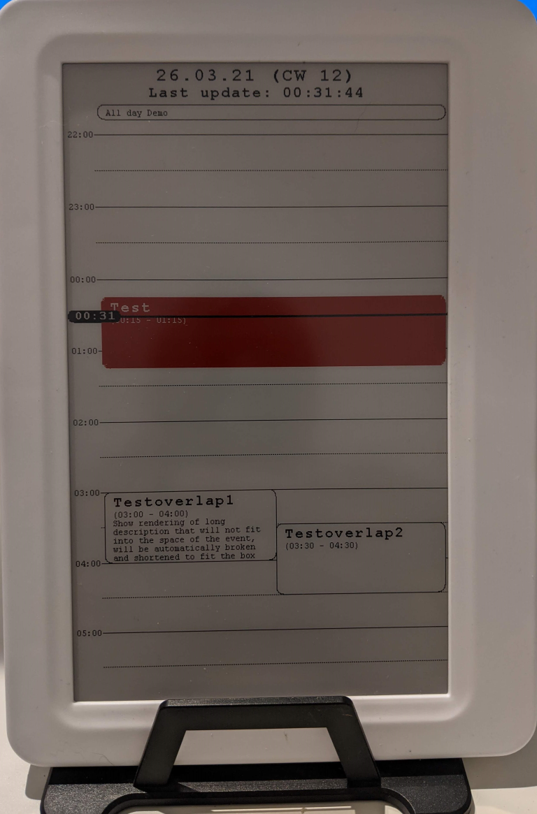

# E-Paper Agenda Display

Renders todays agenda on an e-paper display. The events are received through a webserver running on the esp32. The current version is using a Waveshare 7.5'' HD (B) Black/Red/White Epaper Display.



## Features:
- Show Todays events in an eight hour time frame around the current time (configurable)
- Runs as a webserver, events can be POSTed to the /setEvents endpoint in JSON format
- Show current time as a marker, automatically refreshing every 5 minutes
- Current event is highlighted in Red
- supports overlapping events
- supports all day events
- automatic line breaking and shortening of description texts to fit into event box
- auto select smaller title fonts for short events

### Planned features
- extract into more resusable, standalone library
- publish fixes and improvements for waveshare library
- support week and month views

## Expected JSON Format
````
{
    "events":[
        {
            "start" : "1615244400", // starttime in UTC seconds
            "end": "1615246200", // endtime in UTC seconds
            "title": "The event Title",
            "description": "The event description",
            "allDay": "true"/"false"
        },
        ...
    ]
}
````

## Libraries Used:
- [Waveshare ESP32 e-Paper Driver](https://www.waveshare.com/w/upload/5/50/E-Paper_ESP32_Driver_Board_Code.7z) for setup see [Waveshare's Wiki](https://www.waveshare.com/wiki/7.5inch_HD_e-Paper_HAT_(B))->User Guides of ESP32
- ArduinoJson by [Benoit Blanchon](http://blog.benoitblanchon.fr/) Version 6.17.3 

    An efficient and elegant JSON library for Arduino Supports JSON parsing and formatting. Uses fixed memory allocation.
- ezTime by Rop Gonggrijp Version 0.8.3

    Does NTP, datetime formatted strings, milliseconds and timezones. Drop-in replacement for Arduino Time Library See more on [Github](https://github.com/ropg/ezTime)

- builtin ESP32 Libraries: WiFi, WebServer, ESPmDNS, SPIFFS, FS
